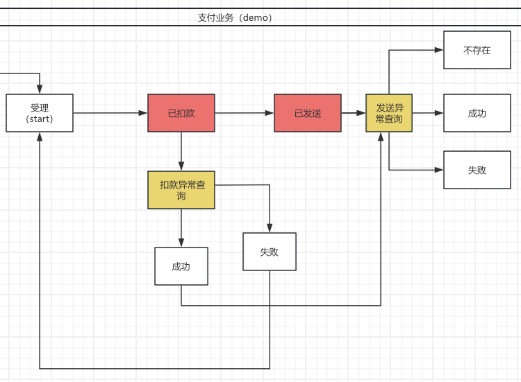
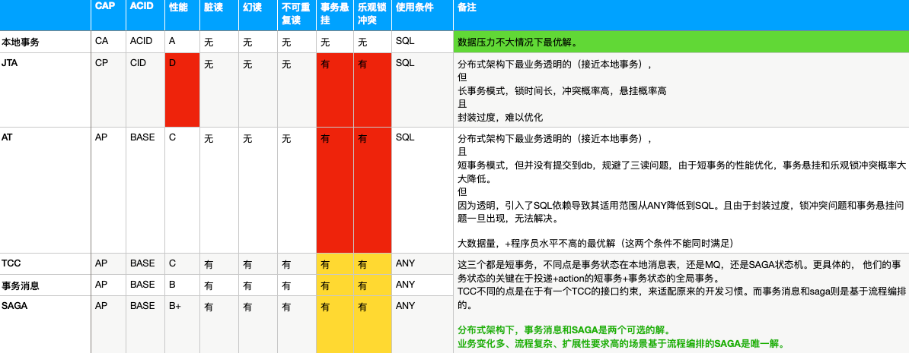
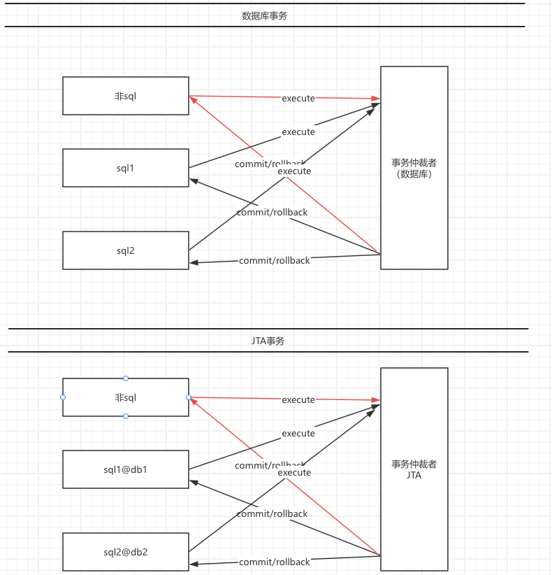
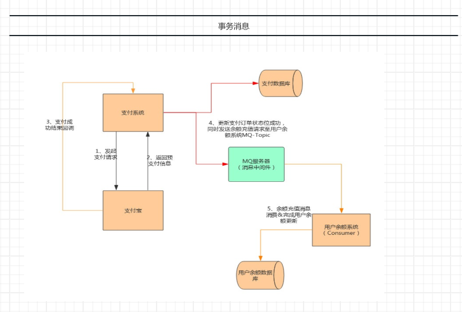
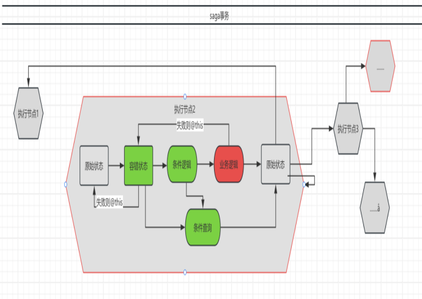

# Saga事务

# quickstart

## 0 场景

## 1 流程编排


``` java 
    @Override
    public Map<PayState, FlowStatus> nodes() {
        Map<PayState, FlowStatus> map = new HashMap<>();
        map.put(PayState.init, FlowStatus.INIT);
        map.put(PayState.payed, FlowStatus.RUNNABLE);
        map.put(PayState.sended, FlowStatus.RUNNABLE);
        map.put(PayState.payed_failover, FlowStatus.RUNNABLE);
        map.put(PayState.sended_failover, FlowStatus.RUNNABLE);
        map.put(PayState.su, FlowStatus.FINISH);
        map.put(PayState.fail, FlowStatus.FINISH);
        map.put(PayState.error, FlowStatus.FINISH);
        return map;
    }
    @Override
    public void transitions(Transitions<PayState> t) {
//        payAction:执行本地扣款
        t.saga(PayState.init, Coasts.EVENT_DEFAULT, Sets.newSet(PayState.init), PayState.payed_failover, "payAction")
                //本地扣款容错payQueryAction 扣款结果查询
                .router(PayState.payed_failover, Coasts.EVENT_DEFAULT, "payQueryAction")
                //发送异常，不明确是否发送
                .saga(PayState.payed, Coasts.EVENT_DEFAULT, Sets.newSet(PayState.payed), PayState.sended_failover, "sendAction")
                .router(PayState.sended_failover, Coasts.EVENT_DEFAULT, "sendQueryAction")
                //sendAction，执行远程发生&sendQueryAction。
                .router(PayState.sended, Coasts.EVENT_DEFAULT, "sendQueryAction");
    }

```


详细  [编排代码](example/src/main/java/cn/hz/ddbm/pc/example/PayFsm.java)

## 2 混沌验证
我们可以在业务逻辑没没有实现的情况下，执行流程。验证

* 1，流程设计是否合理
* 2，整体执行成功率是多少
* 3，可以通过什么机制优化？
* 4，异常情况下，成功率会如何下降？应该如何优化？

```java

    @Test
    public void chaos() throws Exception {
        String event = Coasts.EVENT_DEFAULT; 
        List<ChaosRule> rules = new ArrayList<ChaosRule>() {{
            //注入业务逻辑异常，概率20%
//            add(new ChaosRule(ChaosTarget.ACTION, "true", "action异常", 0.1, new ArrayList<Class<? extends Throwable>>() {{
//                add(RuntimeException.class);
//                add(Exception.class);
//            }}));
            //注入锁错误
//            add(new ChaosRule(ChaosTarget.LOCK, "true", "锁异常", 0.1, new ArrayList<Class<? extends Throwable>>() {{
//                add(RuntimeException.class);
//                add(Exception.class);
//            }}));
        }};
        try {
            //执行1000次，执行报表
            chaosService.execute("test", new ChaosPcService.MockPayLoad(PayState.init), event, 1000, 10, rules, true);
        } catch (Exception e) {
            e.printStackTrace();
        }
    }
```

理想情况下，1000笔交易retry = 1的有（716+79）/1000可以完成。其他卡在执行次数限制上
```shell
2024-08-20 12:39:45.311  INFO 3770 --- [           main] flow                                     : 混沌测试报告：\n
2024-08-20 12:39:45.311  INFO 3770 --- [           main] flow                                     : FlowContext,sended_failover:RUNNABLE,70
2024-08-20 12:39:45.311  INFO 3770 --- [           main] flow                                     : FlowContext,payed_failover:RUNNABLE,125
2024-08-20 12:39:45.311  INFO 3770 --- [           main] flow                                     : FlowContext,init:RUNNABLE,2
2024-08-20 12:39:45.311  INFO 3770 --- [           main] flow                                     : FlowContext,sended:RUNNABLE,8
2024-08-20 12:39:45.311  INFO 3770 --- [           main] flow                                     : FlowContext,fail:FINISH,79
2024-08-20 12:39:45.311  INFO 3770 --- [           main] flow                                     : FlowContext,su:FINISH,716

```
 retry = 2 的情况下 ，有（850+111）/1000可以完成
```shell
2024-08-20 12:40:44.221  INFO 3795 --- [           main] flow                                     : 混沌测试报告：\n
2024-08-20 12:40:44.221  INFO 3795 --- [           main] flow                                     : FlowContext,sended_failover:RUNNABLE,7
2024-08-20 12:40:44.221  INFO 3795 --- [           main] flow                                     : FlowContext,payed_failover:RUNNABLE,30
2024-08-20 12:40:44.221  INFO 3795 --- [           main] flow                                     : FlowContext,sended:RUNNABLE,2
2024-08-20 12:40:44.221  INFO 3795 --- [           main] flow                                     : FlowContext,su:FINISH,850
2024-08-20 12:40:44.221  INFO 3795 --- [           main] flow                                     : FlowContext,fail:FINISH,111
```
混沌情况下&retry =2

```java
           add(new ChaosRule(ChaosTarget.ACTION, "true", "action异常", 0.1, new ArrayList<Class<? extends Throwable>>() {{
               add(RuntimeException.class);
                add(Exception.class);
            }}));
```
```shell
2024-08-20 12:43:43.953  INFO 3824 --- [           main] flow                                     : 混沌测试报告：\n
2024-08-20 12:43:43.953  INFO 3824 --- [           main] flow                                     : FlowContext,sended_failover:RUNNABLE,3
2024-08-20 12:43:43.954  INFO 3824 --- [           main] flow                                     : FlowContext,payed_failover:RUNNABLE,35
2024-08-20 12:43:43.954  INFO 3824 --- [           main] flow                                     : FlowContext,sended:RUNNABLE,2
2024-08-20 12:43:43.954  INFO 3824 --- [           main] flow                                     : FlowContext,fail:FINISH,118
2024-08-20 12:43:43.954  INFO 3824 --- [           main] flow                                     : FlowContext,su:FINISH,840

```


## 3 逻辑实现

参见 [业务逻辑实现](example/src/main/java/cn/hz/ddbm/pc/example/actions)


# 事务实现机制选型


1. 数据压力不大，本地事务是最优解
2. 分布式架构下，事务消息&SAGA事务是唯2可用的解，其他有硬伤
3. 业务复杂度很高，业务变化很快、业务很复杂，SAGA事务（即基于流程编排的事务）是唯一解。

# 最佳实践

1. 长业务可拆分为N个短业务的组合，长事务可拆分为N个短事务的组合
2. 短业务标准化、积木化
3. 长业务编排化
4. 流程编排的关键包含两个：一致性&副作用控制
5. 每个短事务应该只包含一个变化
6. 事务操作，容错优先
7. 非冥等业务（事务业务），可包装为条件执行的冥等业务


# 事务实现原理比较





# 性能比较（事务消息/流程编排）
