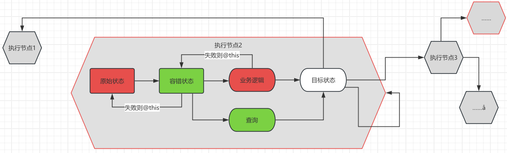
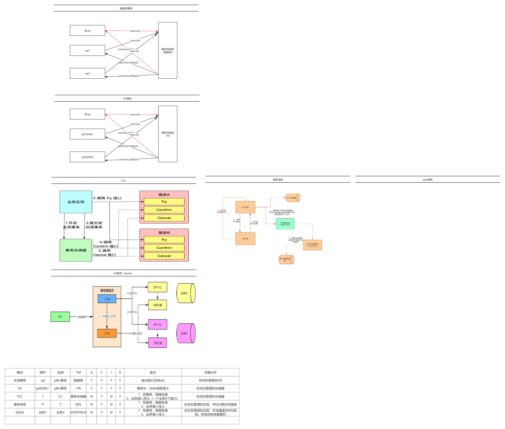
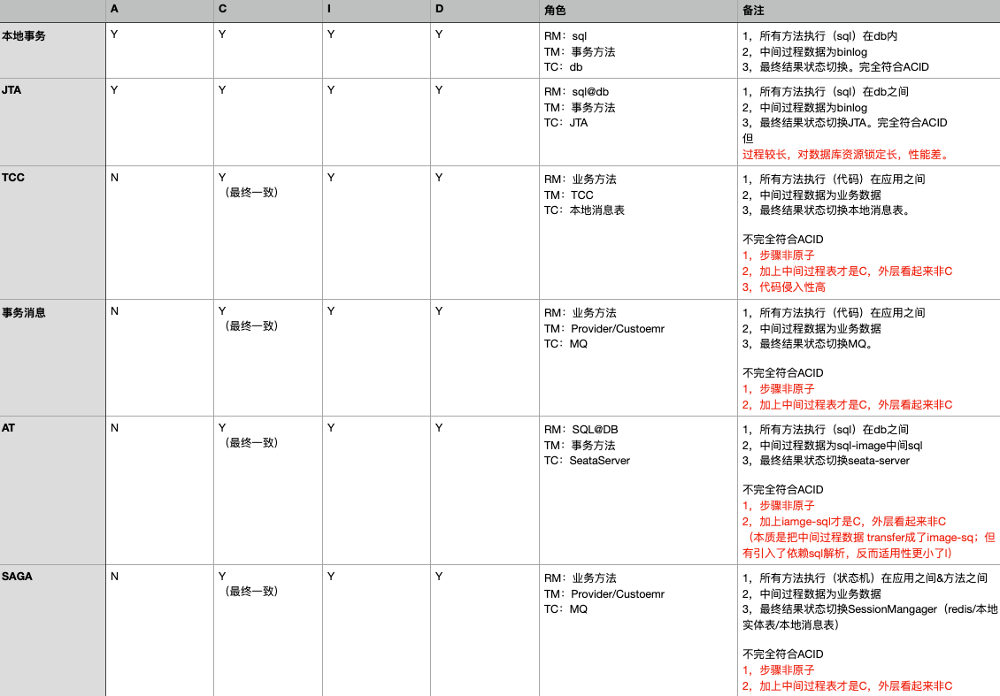

# saga事务介绍

## 概述

在功能介绍中介绍的大部分好处。坦率讲是可有可无的。无论是高可扩展，可配置、关注点分离……

不用，其实也没有太大的问题。。。。。无非就是工作量多一点，少一点，清晰不清晰——反正用户又感知不到。

但有两个例外

1，一致性

2，混沌工程&健壮性验证

这两个，刚开始确实随便写也可以。但随着需求的堆积，变化。就改不动了，不敢改了。而业务需求是不能say no的，即使在s山上，也要咬着牙实现它。直到最后了沦陷，或者重构——进入一下一个循环。

按随便写写方式设计的流程，在混沌工程之下，很容易验出很多不足。流程先行&混沌验证让你慢慢遵循着正确的设计思路来

    1，冥等逻辑和非冥等逻辑分离
    2，容错逻辑优于业务逻辑
    3，任何地方都可能抛出任何错误，应该在哪里处理它？这些处理逻辑对过去透明么？
    ……

**这个组件最大的好处就是：让大多数不用掌握和思考这些问题的细节的设计。就能设计出高健壮性、高一致性、高可扩展、重构友好的架构**

**这也是它和其他流程编排组件的区别，并不是可视化，注册中心……配置化……**

## 原理

* 一个长流程复杂事务由N个节点装成
* 其中每两个执行节点的状态变迁组成了一个原子变迁
* 确保每个原子变迁的一致性，如此反复执行，就能确保整个流程的一致性
* 每个原子变迁的事务机制如图
    * 1，在业务执行前，先将状态改为当前状态的容错状态，如果失败则停止。
    * 2，成功则执行业务逻辑，并更改状态为目标状态
    * 3，2步骤中有异常，则状态位为容错状态，下次执行时查询当前节点目标状态。

saga事务的本质

    1，微积分事务，base一致性
    2，将一个非冥等业务逻辑，转为一个冥等业务逻辑（条件执行）

**名词说明**

* 流程：包含了N个执行步骤
* 原子变迁类型
    * saga：变迁是非冥等的，从from状态到failover状态/目标中泰，中间执行的是业务逻辑，变迁是非冥等的。失败则状态在failover。
    * router：从failover到目标状态集合，中间执行的是业务执行状态查询逻辑（结果有多个），变迁是冥等的，
    * to：从from到to，中间执行的是业务查询逻辑，（如信息查询，结果只有一个）变迁是冥等的，失败则返回from再次执行。

# 事务实现机制比较

从机制上讲，SAGA和事务消息是很像的

    1，事务消息是通过MQ保存事务状态（状态）的， SAGA的状态管理则类似于本地消息表（memory/redis/本地消息表……）
    2，状态感知MQ是通过mqsdk的拉模式，而saga则是sdk轮询/xxljob调度轮训……
    3，业务逻辑是一个个状态串起来的业务逻辑块，一个叫生产者消费者。另外一个叫状态变迁。

不同的地方

    1，mq的事务流程是生产者消费者之间的订阅关系图，并不直观；saga则维持了一个全局的状态机定义可以看到完整的业务流程。
    2，消息事务这是生产者消费者结构。而saga则是一套framework。前者很薄，后者里面封装了插件隔离，状态管理，会话管理，统计管理……
    3，消息事务是绑死在mq上的，saga则基于spi架构，可以灵活切换各种实现
          statusManager：mem，redis，本地消息、延迟队列……
          sessionmanger：mem，redis
          锁：重入锁，redis
          状态调度：sdk，xxljob、延迟队列、。。。
     4，消息事务缺乏重试调度能力
  
  
    
    

