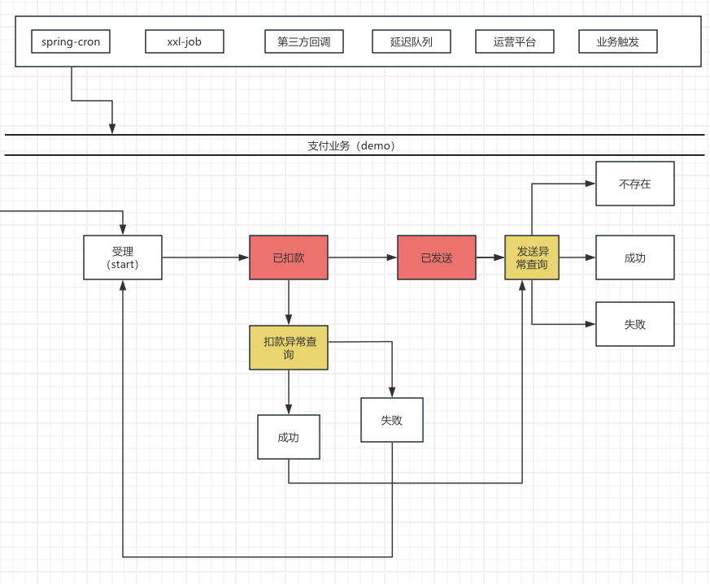
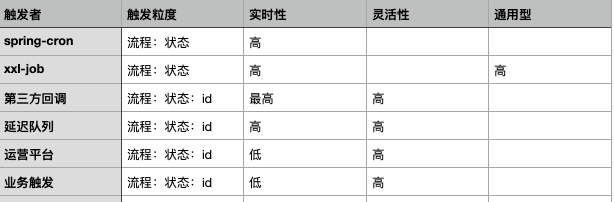

# 架构图

## spring-cron 
通过spring-cron定时产生特定工作流的事件数据。

写法：

    XXXFlowFsm{
    @Schedule(type="cron",cronExpression="? * * * * * ")
    public void schedule();
    }

## xxl-job

    @Schedule('xxxxx，type=“xxl-job”)
    public void schedule();

## 第三方回调

1，业务代码配置

        t.saga(PayState.init, Coasts.EVENT_DEFAULT, Sets.newSet(PayState.init), PayState.payed_failover, "payAction")
                //第三方回调事件路由
                .router(PayState.payed_failover, “xxxNotify”, "xxxNotifyAction")

2，第三方回调使用此事件码触发对应报文解析逻辑。报文封装在payload中。

## 延迟队列

1，schedule-delay-queue模块中增加对延迟队列的监听

2，action逻辑中向延迟队列发送当前任务下一次执行时间的消息。

## 运营平台

略

## 业务触发

业务代码中可以硬编码触发。

# 特性比较

 

