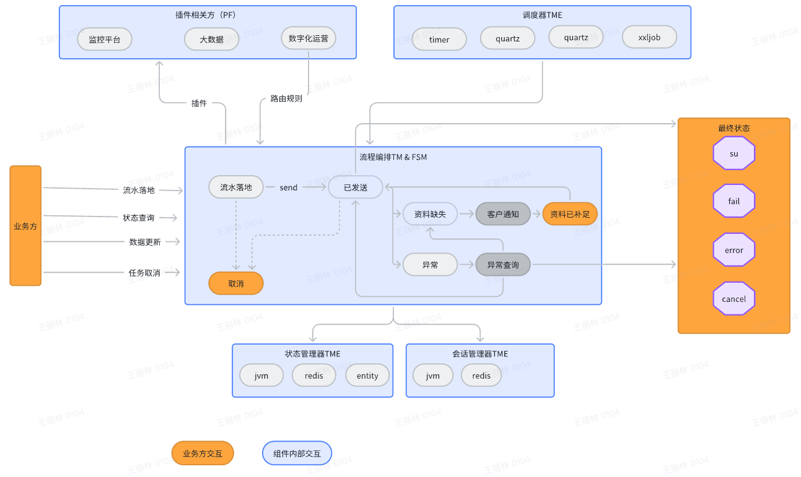
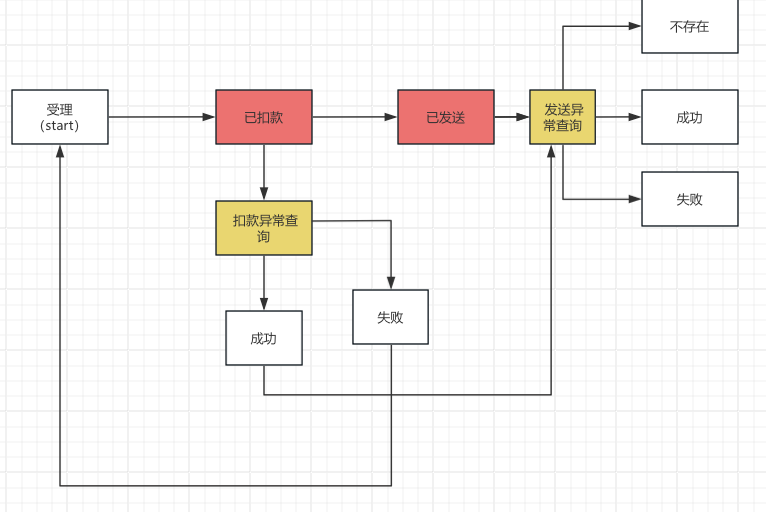
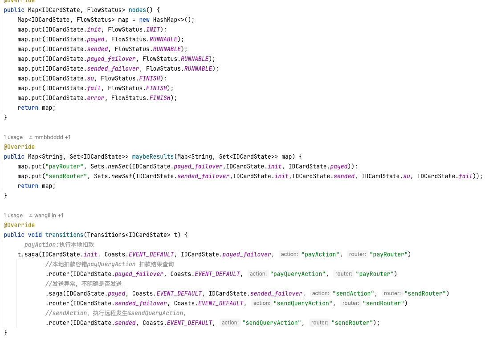
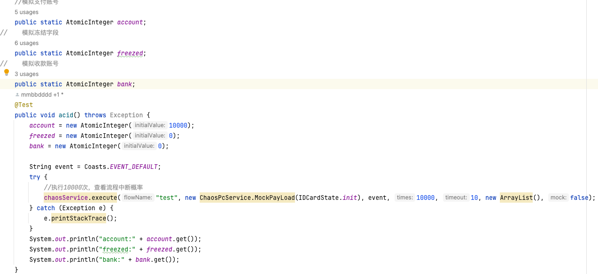
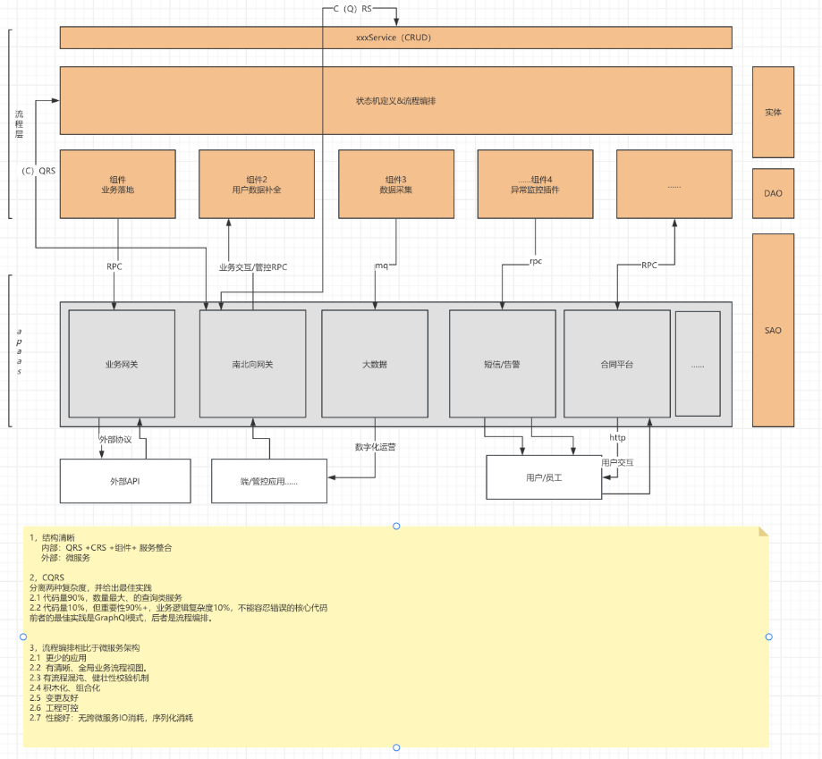

# 流程先行

架构师对于架构如何做很容易陷入到进退两难的地步。

做，很容易过度设计。

不做，系统很容易腐化、失去控制。

进退的分寸在哪里？

应该如何做？才能真正让架构“如东家之子，增之一分则肥，减之一分则瘦”呢？

**答案的关键是流程编排**

    对于一个公司的管理者，要让公司的整体架构最优。
    一定是推行客户第一，通过流程整合来实现公司能力的整合。

    对于一个封闭系统，要让系统熵减。
    一定是首先转变为一个开放系统，让持续的信息和能量交互才能变得有序、高效。

    对于架构师而言。
    必须意识到流程在整个架构中的关键性作用（聚合跟：信息决定架构）
    掌握关于流程的架构组件和用法、是架构学习、设计、落地、治理……的关键中的关阿金

# 快速验证业务模式

例：身份证办理流程



1，编写流程编排文件

参见 cn.hz.ddbm.pc.example.PayFsm

2，使用混沌方法验证流程可行性

    chaosService.execute("test", new ChaosPcService.MockPayLoad(IDCardState.init.name()), event, 100, 10, rules, true)
    
    2024-08-17 23:02:59.539  INFO 13180 --- [           main] flow                                     : 混沌测试报告：\n
    2024-08-17 23:02:59.539  INFO 13180 --- [           main] flow                                     : IllegalArgumentException,找不到事件处理器push@init,100

# 通过混沌工程优化流程

1,注入混沌错误

```java
        List<ChaosRule> rules=new ArrayList<ChaosRule>(){{
        //注入业务逻辑异常，概率20%
        add(new ChaosRule(ChaosTarget.ACTION,"true","action异常",0.2,new ArrayList<Class<?extends Throwable>>(){{
        add(RuntimeException.class);
        add(Exception.class);
        }}));
        }};
        try{
        //执行100此，查看流程中断概率
        chaosService.execute("test",new ChaosPcService.MockPayLoad(IDCardState.init.name()),event,100,10,rules,true);
        }catch(Exception e){
        e.printStackTrace();
        }
```

2，查看流程成功率报表

    2024-08-18 00:51:38.343  INFO 17364 --- [           main] flow                                     : 混沌测试报告：\n
    2024-08-18 00:51:38.343  INFO 17364 --- [           main] flow                                     : FlowContext,PAUSE:miss_data,2
    2024-08-18 00:51:38.343  INFO 17364 --- [           main] flow                                     : FlowContext,PAUSE:init,2
    2024-08-18 00:51:38.343  INFO 17364 --- [           main] flow                                     : FlowContext,RUNNABLE:init,15
    2024-08-18 00:51:38.343  INFO 17364 --- [           main] flow                                     : FlowContext,RUNNABLE:miss_data_fulled,2
    2024-08-18 00:51:38.343  INFO 17364 --- [           main] flow                                     : FlowContext,RUNNABLE:su,79

可以看到 有79个办理成功，只有2个是因为缺失资料无法办理。剩下29个都是因为各个环节的限流。

3，优化流程，增加业务成功率

    3.1 增加重试次数，降低限流
    3.2 和其他部门联网，减少向客户索取资料的情况
    ……

# 提升健壮性

如上，混沌测试还可以模拟技术类的错误。

        List<ChaosRule> rules = new ArrayList<ChaosRule>() {{
            //注入业务逻辑异常，概率20%
            add(new ChaosRule(ChaosTarget.ACTION, "true","action异常",0.2, new ArrayList<Class<? extends Throwable>>() {{
                add(RuntimeException.class);
                add(Exception.class);
            }}));
            //注入锁异常，概率90%
            add(new ChaosRule(ChaosTarget.LOCK, "true","action异常",0.9, new ArrayList<Class<? extends Throwable>>() {{
                add(RuntimeException.class);
                add(Exception.class);
            }}));
        }};
        try {
            //执行100次，打印统计报表
            chaosService.execute("test", new ChaosPcService.MockPayLoad(IDCardState.init.name()), event, 100, 10, rules, true);
        } catch (Exception e) {
            e.printStackTrace();
        }
    2024-08-18 00:58:48.901  INFO 18396 --- [           main] flow                                     : 混沌测试报告：\n
    2024-08-18 00:58:48.901  INFO 18396 --- [           main] flow                                     : FlowContext,PAUSE:miss_data,1
    2024-08-18 00:58:48.901  INFO 18396 --- [           main] flow                                     : FlowContext,RUNNABLE:miss_data,3
    2024-08-18 00:58:48.901  INFO 18396 --- [           main] flow                                     : FlowContext,PAUSE:init,3
    2024-08-18 00:58:48.901  INFO 18396 --- [           main] flow                                     : FlowContext,RUNNABLE:init,19
    2024-08-18 00:58:48.901  INFO 18396 --- [           main] flow                                     : FlowContext,RUNNABLE:sended,1
    2024-08-18 00:58:48.901  INFO 18396 --- [           main] flow                                     : FlowContext,RUNNABLE:su,73

可以看到，成功率降低到了73.

# 一致性++

如上支付流程 ，需要确保一致性


编排业务流程如下



测试数据如上



测试结果如下

    2024-08-19 13:22:32.576  INFO 36589 --- [           main] flow                                     : 混沌测试报告：\n
    2024-08-19 13:22:32.577  INFO 36589 --- [           main] flow                                     : FlowContext,sended_failover:RUNNABLE,710
    2024-08-19 13:22:32.577  INFO 36589 --- [           main] flow                                     : FlowContext,payed_failover:RUNNABLE,1267
    2024-08-19 13:22:32.577  INFO 36589 --- [           main] flow                                     : FlowContext,init:RUNNABLE,9
    2024-08-19 13:22:32.577  INFO 36589 --- [           main] flow                                     : FlowContext,sended:RUNNABLE,654
    2024-08-19 13:22:32.577  INFO 36589 --- [           main] flow                                     : FlowContext,payed:RUNNABLE,583
    2024-08-19 13:22:32.577  INFO 36589 --- [           main] flow                                     : FlowContext,fail:FINISH,3192
    2024-08-19 13:22:32.577  INFO 36589 --- [           main] flow                                     : FlowContext,su:FINISH,3579
    account:3201
    freezed:3218   
    bank:3581   

总金额是对的，银行首款比支付成功交易多了2笔。 查看交易流程，为中间状态（sended_failover，payed_failover）

原理参见 《saga事务》
[saga事务](saga事务.md)

# 架构可视

# 高性能

欢迎评测。
逻辑上来讲
1，核心是一个内存状态机。没有任何io和锁。

2，在非异常情况下，各个原子变迁是连续执行的，只是内存状态切换。

3，在异常情况下，产生一次状态持久化，持久化可根据实际情况选用不同的实现
io次数是最少的、io成本按需选用

    memory：适用于同步，长流程业务，高性能业务
    redis：适用于异步，长流程，分布式，高性能业务
    本地消息：适用于异步、长流程、分布式、高一致性业务

4，相比其他的事务实现，需要引入TC、TM、RM

    ————SAGA没有TC，他的TC就是应用实体.status本身
    ————SAGA没有TM，他的TM就是应用的状态及

结构上3合1，没有IO成本引入。相比性能最高的MQ事务。他通过本地消息模式，将MQ的IO消耗也几乎压缩到了最对。

**非常适用于：复杂、长流程、核心交易系统**

# 工程可控

工程上分为2块

    1，状态机文件定义和论证
        1.1  流程设计和论证
        1.2  流程验证和优化 
    2，组件（action）开发阶段
        2.1 组件清单
        2.2 组件开发和进度管理
        2.3 集成和测试

积木化的、分工、结构清晰的微模块+微服务架构。



