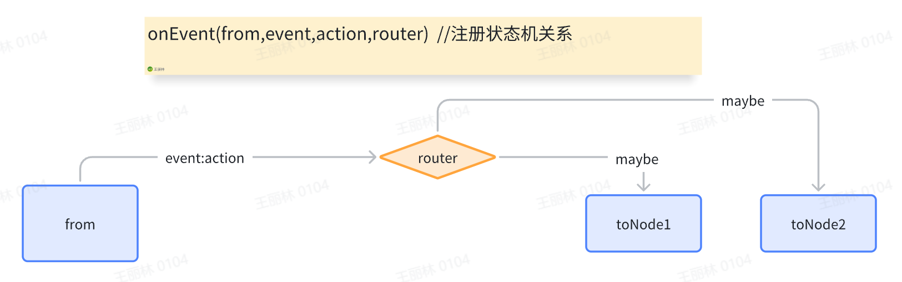
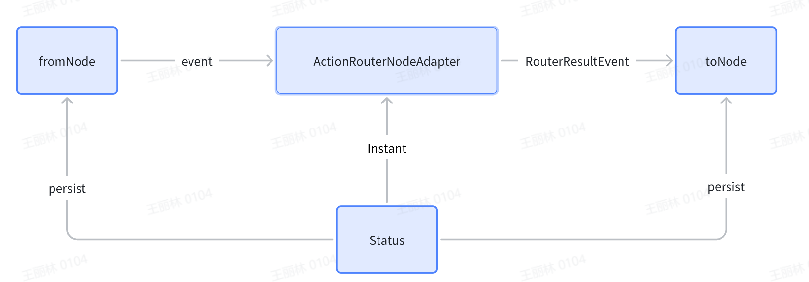

# 设计：router概念解析和优化

## 问题分析

对于router的设计方案，有两种方案

1，spring-state-machine的设计：没有router，

     抽象模型：node和event
     在代码上，就是（from(node).to(node).on(event)

2，process-control的设计：有router

    抽象模型：node，event，action，router 
    在代码上，就是from(node).on(event,action,router).getToNode()

这两种设计方案，哪一种好呢？
1，spring-state-machine的编程模型更简单，健壮性更高。

2，process-control对工程开发更直观，比较方便编排流程比较复杂的逻辑。

    spring-state-machine（ssm）也可以。做法是这样的
    
    action==》事件==》ssm状态机

    但这个设计，打破了ssm设计中node =>event=>node（nen）的哲学。
    要么action也是node……以及承认——
    1，ssm的状态机定义的流程只是部分的流程。而不是完整的。
    2，action是不确定性的，不可靠的。其定义的流程（整体）是不可靠的。
 
    
    会存在如下问题

    1，在消息外发的过程中，如果出现异常了。应该怎么做？
    2，这种做法能保证一致性么？性能OK么？
    3，在工程上管理上可行么？
    4，这种描述流结构和方向的职责，
            究竟应该是action的职责？
            还是流程的职责？
            如果删除了这个action，流程还能运行么？

     更健壮的方案是什么？

## 设计方案

    1，流程和业务逻辑分离（actionImpl）
    2，流程内容包含node，event，action（的声明而非实现），router
    3，流程本身是完备的，可自运行的。不依赖于具体实现（actionImpl）

这带来几个好处

1，流程在概念上是完整的，不依赖于局部。

2，流程本身的职责（路由），没有侵入到action之中。

3，action是干净的，彼此隔离的，无副作用的，可随意编排，组合，删减，变更。

4，业务逻辑的变更，增删，不影响整体，不影响其他action。

    https://www.bilibili.com/video/BV15C411V7Bs/?spm_id_from=333.337.search-card.all.click

    混沌的哲学本质是：自指。
    
    自指的根本特征是：整体，局部互相依赖。

## 技术优化

虽然router在设计上是一等概念。

但是在技术实现行，是可以实现为action的一个特殊实现。缩减基本概念为3个。

加强组件的概念归一性和实现健壮性。

**逻辑架构**

**技术实现架构**

# 附录

## saga事务

A==>B要保证一致性，需要

* 1:  A的状态位先迁移到A|，A|的作用是查询A的业务是否成功，实际状态是什么。
* 2:  A状态位置A|如果成功，执行ToB的业务逻辑，执行成功，则状态位设置为B。
* 3:  2的环节中出了异常，则状态位是A| 查询A的执行结果（应该是A，B或者异常），根据执行结果重置状态位。
* 4:  3的环节如果出了异常，则状态位是A|，反复执行，没什么副作用，最终一定能确保A=B成功，并且状态一致。

saga事务非常适合长流程、复杂结构的流程。

它是这种情况下理论最高性能，最灵活、覆盖能力最广的的事务实现

    例如DB事务不能回滚发出去的消息，
    不能删除已存储成功的文件
    DB事务的一致性是业务的参与方都是DB，都支持JDBC事务。
    在微服务架构中，这情况很少。

saga事务是事务的最普遍实现。是最适合微服务的的。

## 备注关注

ssm3升级上去后发现

1，更简单了，而不似之前2那么混乱。

2，action成为了一等公民，但是依然没有看到router

3，很笨拙的使用了2个action来实现异常容错————

4，整体上看，概念上已经接近了pc的设计。还有一点差异 主要是router

5，最关键的问题是流程和逻辑分离。

6，持续关注，如ssm架构等价于pc的时候，可以考虑底层适配到ssm————毕竟基数很大，可以复用它的生态。底层用我们自己的生态。

7，有一点纠结的是ssm的设计太复杂了。这说明它的开发很多事情没想清楚，是为了技术而堆叠代码，堆叠模式。

