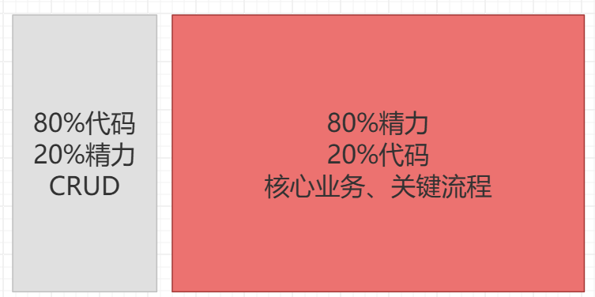
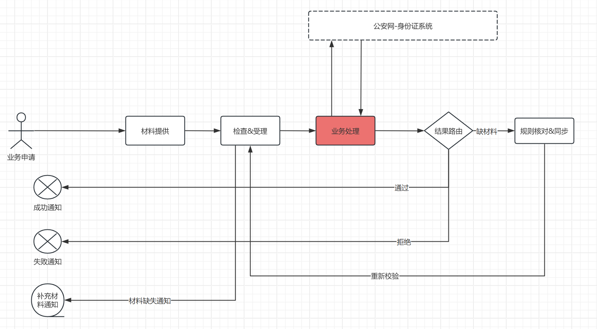

# 简要说明



这80%的精力除了
1. 加强管理
2. 加强设计
3. 加强测试
4. 加强审批 

……等堆人的、不可靠的方式外，是否有更好的选择？


<HR><H3>
流程编排：积木化、组装式构建复杂、长流程、一致性交易系统。
</H3><HR>
 


# 快速开始

1， 业务场景

一个典型的长、自由、复杂的流程。


2， 编排流程

```java


```

2，测试

```log


```

# 功能说明（场景)

1. 快速原型验证
2. 项目风险梳理和控制
3. 一致性
4. 鲁棒性 
5. 监控、埋点……非业务功能可插拔，可复用

# 设计文档